<!-- Profile header -->

### Builder of AI-agent tooling, scientific simulators, and full-stack apps.

---

## 👋 About Me

I build **agent-driven software at scale** — from Claude Code skills and multi-agent workflows to mobile apps, FastAPI backends, and scientific/medical simulators. I like turning big, messy ideas into shipped, well-engineered systems.

---

## 🧰 Skills & Tech

| Area | Technologies |
|------|--------------|
| **Languages** | Python · Dart · TypeScript · JavaScript · C++ · C · Java · R · NASM Assembly · SQL |
| **AI / ML** | Machine Learning · Deep Learning · NLP · LSTMs · Computer Vision · Agentic AI · RAG |
| **Mobile & Web** | Flutter · FastAPI · Node/TypeScript · Vanilla JS · HTML/CSS · Vercel |
| **Backend & Data** | REST APIs · PostgreSQL · pgvector · Docker · OpenAPI |
| **AI Agent Tooling** | Claude Code skills & slash commands · Kaggle automation · multi-agent workflows |
| **CS Foundations** | Operating systems · computer architecture · assembly/NASM · algorithms & data structures |

---

## 🚀 Featured Projects

### 🤖 AI Agents & Developer Tooling
- **PakimonGO** — A 13+ mobile app for real-animal photography: discovery, collections, map exploration, and server-scored competition. Built with Flutter + FastAPI through an agent-driven engineering process. *(private)*
- **[agentic-ai-megaproject-template](https://github.com/hammadshakeelai/agentic-ai-megaproject-template)** — Topic-agnostic starter for building super-large software projects with AI agents: phase-gated lifecycle, state-file memory, traceability chain, adversarial ADRs, and CI gates.
- **[kaggle-run-skill](https://github.com/hammadshakeelai/kaggle-run-skill)** — Kaggle slash command for Claude Code & 35+ AI agents: deploy notebooks, auto-fix 13 error patterns, submit competitions — a token-minimal 165-line router + Python scripts.
- **[mcq-maker](https://github.com/hammadshakeelai/mcq-maker)** — Reusable Claude Skill that turns any document into a high-quality MCQ quiz (interactive site + Word export).
- **[cli-chatbot](https://github.com/hammadshakeelai/cli-chatbot)** — Web terminal with agents, built for phones — a step toward web-based full computer systems.
- **[chatbot-like-claude](https://github.com/hammadshakeelai/chatbot-like-claude)** — Minimal, self-hostable Claude-style AI chat app with streaming replies and OpenAI-compatible models.
- **[food-suggestor](https://github.com/hammadshakeelai/food-suggestor)** — Pink Plate (Agnes AI): a mobile-first AI recipe chatbot, zero deps, Vercel-ready.
- **[ClaudeSessionScheduler](https://github.com/hammadshakeelai/ClaudeSessionScheduler)** — Fast, offline, single-file planner for sleep, life, and up to 10 Claude sessions per reset cycle.

### 🔬 Scientific Simulation & Visualization
- **[RetinoTwin](https://github.com/hammadshakeelai/RetinoTwin)** — Synthetic retinoblastoma digital-twin & multimodal imaging simulator using real volumetric MRI from the MNI152 eye atlas.
- **[Nano-Swarm-Intelligence-Coronary-Clot-Simulator](https://github.com/hammadshakeelai/Nano-Swarm-Intelligence-Coronary-Clot-Simulator)** — Swarm-intelligence simulation of nanobots clearing coronary clots.
- **[LSTM-visualized](https://github.com/hammadshakeelai/LSTM-visualized)** — Interactive visualization of LSTM internals.
- **[TOP-10-NLP-ALGORITHMS-SIMULATORS](https://github.com/hammadshakeelai/TOP-10-NLP-ALGORITHMS-SIMULATORS)** — Simulators for the top 10 NLP algorithms.

### 🕹️ Apps & Systems
- **[Game-Database-Project](https://github.com/hammadshakeelai/Game-Database-Project)** — A game built to be deployed and appified.
- **[Software-Engineering-Project--UTOS](https://github.com/hammadshakeelai/Software-Engineering-Project--UTOS)** — University timetabling & scheduling website.
- **[GPA-Calculator-Adanced-Project-IMS](https://github.com/hammadshakeelai/GPA-Calculator-Adanced-Project-IMS)** — Fast public/private GPA calculator with presets.
- **[Mafia-Host-Tool](https://github.com/hammadshakeelai/Mafia-Host-Tool)** — Web tool that distributes Mafia roles between players.

---

## 📊 GitHub Activity

---

## 🤝 Let's Connect

Thanks for stopping by! I'm always up for building something ambitious — from agent tooling to simulators to full-stack products. If any of this resonates, let's talk.

  

