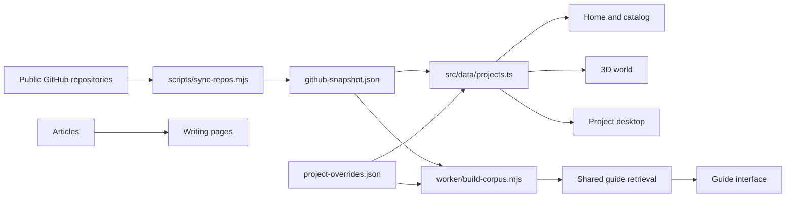

# Architecture

Hammad’s Lab is a static React 19 + TypeScript application built with Vite. GitHub Pages serves the portfolio and a separately built copy of the original Nano-Swarm app. An optional Cloudflare Worker provides AI answers; the same interface always has a local search fallback.

## Content flow

`src/data/types.ts` defines `Project`. `src/data/projects.ts` merges generated GitHub metadata with editorial overrides, sets safe source-only defaults, preserves fork attribution, and orders featured projects. New repositories appear without UI changes. Only editorial entries can grant embedding permission. `scripts/validate-content.mjs` validates the catalog before production builds.

`src/data/articles.ts` holds the technical walkthroughs. Featured case studies live with their project overrides. `public/media/` contains project media; `public/profile.html` is the printable profile. Use the browser print dialog to save the profile as a PDF.

## Routes and shared state

`src/App.tsx` composes the experience. `src/lib/navigation.ts` reads hash routes, handles browser history changes, and resolves assets using Vite’s base path. The repository base is `/hammadshakeelai/`; keep all local asset links behind `asset()` or `import.meta.env.BASE_URL`.

| Hash route | Content |
| --- | --- |
| `#/` | Cinematic homepage |
| `#/projects` | Searchable full catalog |
| `#/project/:id` | Preview, source links, and case study |
| `#/explore` | Three-room world and accessible project links |
| `#/desktop` | Project windows, dock, search, and terminal |
| `#/about` | Biography, skills, activity, and table tennis |
| `#/writing` | Article index |
| `#/writing/:id` | Technical walkthrough |

Project IDs derive from lowercase repository names. Every view opens the same project record. `useDemo` in `src/lib/store.ts` owns the single active embedded app; opening another replaces the previous session. Route changes stop the active embed. Desktop window positions, sizes, and minimized state belong to `Desktop.tsx`.

`useSettings` persists quality and motion preferences through Zustand. Sound starts muted on every visit and is enabled by a user gesture. Explore discoveries use a separately validated local-storage list. These browser settings contain no credentials.

## Previews and progressive enhancement

`ProjectPreview.tsx` starts with media or an explicitly labeled illustration. It creates an iframe only after the visitor chooses to interact and only when `embedVerified` is true. Fullscreen previews, the external launch link, and source links remain available. An iframe’s load event is not evidence that cross-origin content rendered successfully; framing support must be checked in a browser before changing the editorial flag.

The mobile Android exhibit uses a phone gallery. Blocked or unavailable applications retain their preview, documentation, and external/source links. Reference players and landing pages retain their explicit presentation labels.

Three.js, React Three Fiber, Drei, desktop, guide, and Pong components load lazily. `SceneBoundary` and each Canvas fallback preserve HTML navigation when WebGL is unavailable. The project catalog, articles, and project links work without the 3D view.

## Rendering and controls

`src/scene/HeroScene.tsx` builds the orbital sculpture from procedural geometry. `ExploreScene.tsx` positions the ten featured project stations across the Observatory, Workshop, and Exhibition. The probe uses focused keyboard controls or pointer/touch direction buttons. Destination buttons and Reset view restore a predictable camera position; every exhibit also has an HTML link outside the Canvas.

`src/scene/shared.tsx` supplies procedural studio lighting, visibility detection, and adaptive resolution. Hidden tabs and scenes outside the viewport stop their frame loop. Reduced motion uses on-demand rendering; explicit probe movement and enabled physics still render while being used. Decorative motion stays disabled. Movement deltas are capped to avoid jumps after suspension. Resolution is capped at 1× in Low, 1.5× in Auto, and 2× in High; Auto drops to 1× after sustained slow rendering.

Rapier is imported only when the visitor requests physics cubes. Physics pauses while the world is inactive. Keyboard movement stops on blur, hidden/offscreen transitions, and destination changes, so an interrupted key press cannot leave the probe moving.

## Guide and publishing

`worker/search.ts` contains retrieval and response/source validation shared by browser fallback and Worker inference. `worker/index.ts` bounds requests, checks origins, enforces rate-limit bindings, retrieves public evidence, and rejects invalid model references. Timeout, unavailable inference, or quota exhaustion returns search results. Credentials stay in the Worker account and Wrangler authentication; `VITE_GUIDE_URL` is only a public endpoint URL.

`.github/workflows/deploy.yml` refreshes metadata, regenerates guide content, runs tests, builds Nano-Swarm at the pinned original revision, builds the portfolio, and deploys the artifact to GitHub Pages. It runs on pushes to `main`, manual dispatch, and a weekly schedule; pull requests build without deploying. The profile README and Pac-Man workflow are independent.

`scripts/build-demo.mjs` checks out the pinned Nano-Swarm revision into ignored `.demo-source/`, runs its original build with the nested Pages base, and copies the result into ignored `public/demos/nano-swarm/`. Do not edit the generated demo output. Change the pinned revision deliberately and retest it before publishing.

## Code mapping

Graphify is a local development aid, not a production dependency. Use structural extraction over `src`, `worker`, and `scripts`; exclude dependencies, `.demo-source`, built assets, public demo output, and generated graphs. Keep generated output under ignored `graphify-out/`. Start questions from a relevant symbol and query a bounded neighborhood instead of loading the complete graph into a conversation. Regenerate after changing module structure and verify findings against source files.

The root implementation task records the exact installed Graphify command and extraction result in the maintenance documentation. Graph data must never be copied into `public/` or `dist/`.

## Verification

Run `npm test` for catalog, preview/window behavior, and guide validation. Run `npm run build` for content validation, TypeScript, and production bundling. Run `npm run build:demo` when verifying a full deploy artifact. Browser checks must cover embedded apps, hash refreshes, desktop window controls, mobile layouts, keyboard navigation, reduced motion, and WebGL fallback; unit tests cannot establish cross-origin framing support.
